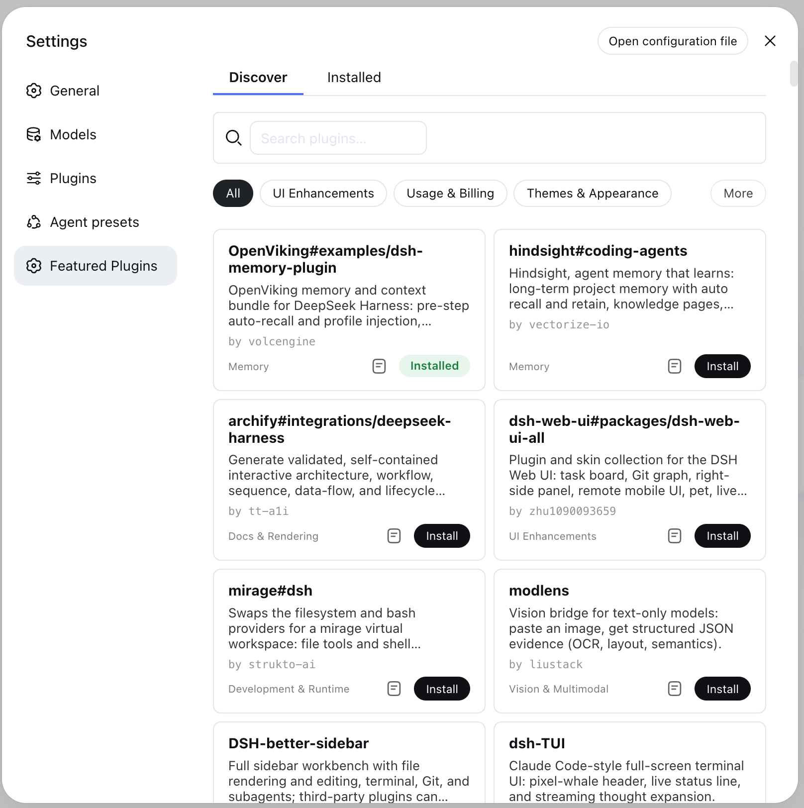

# dsh-featured-plugins

A DSH featured-plugin marketplace: browse, search, install, verify, and update community plugins from the Settings page. It reuses the host's own plugin command (rather than bundling its own installer), so the same package serves both a `dsh` host and a renamed `dsw` host unchanged, with zero configuration.

> This project is in an early stage (`0.1.0`).
>
> [中文版 →](README.md)



## Features

- **Browse the catalog**: a bundled snapshot of featured plugins (`data/registry-snapshot.json`), filterable by category, with EN/ZH descriptions and screenshots.
- **One-click install / remove**: executed via the host's `plugin add` / `plugin remove` command; the install target is resolved server-side from the curated registry (the client only sends a registry entry `url`, never an arbitrary target).
- **Status view**: activation state per installed plugin (`live` / `restart` / `inert` / `broken` / `missing`).
- **Enable / disable**: persisted to the profile state file and applied on the next host boot (the market does not hot-unmount).
- **Update detection**: semver comparison for npm packages, commit-SHA comparison for GitHub installs, with a 30-minute TTL cache.

## Architecture

```
src/
  index.ts     Host entry: apply(ctx, config), mounts routes after injecting webServer + loader
  config.ts    Config resolution: profile, registry URL, cache TTL
  routes.ts    HTTP route layer (parse request → call service → serialize response)
  registry.ts  Catalog loading (remote registry + bundled snapshot fallback), install-target resolution
  spawn.ts     Plugin-command execution (spawns the host's own plugin command)
  profile.ts   Reads profile bundles / installed plugins / entry detection
  verify.ts    Activation state machine (live/restart/inert/broken/missing)
  updates.ts   Update detection
  state.ts     Persists the disabled set (.dsh-featured-plugins/state.json)
  client/      Settings UI (MarketSection.tsx + styles + locales)
data/
  registry-snapshot.json  Bundled featured-plugin snapshot (fallback when the remote is unavailable)
```

## Development

```bash
# Install dependencies (a deepseek-work workspace member, used only for dependency resolution)
pnpm install

# Build (server tsc + client tsdown)
pnpm build

# Typecheck
pnpm typecheck

# Test
pnpm test
```

The host environment requires `@deepseek-ai/cordis ^4.0.1` (peerDependency).

### Local verification

Once the market is booted by the host, its HTTP routes are mounted on the host web server:

- `GET  /market/list`        Featured catalog + source (remote registry or bundled snapshot)
- `POST /market/install`     Install (body: `{ url }`, same-origin required)
- `POST /market/remove`      Remove (body: `{ name }`)
- `POST /market/set-enabled` Enable/disable (body: `{ name, enabled }`)
- `GET  /market/status`      Installed plugins + activation states
- `POST /market/cancel`      Cancel an in-progress install

## License

MIT
