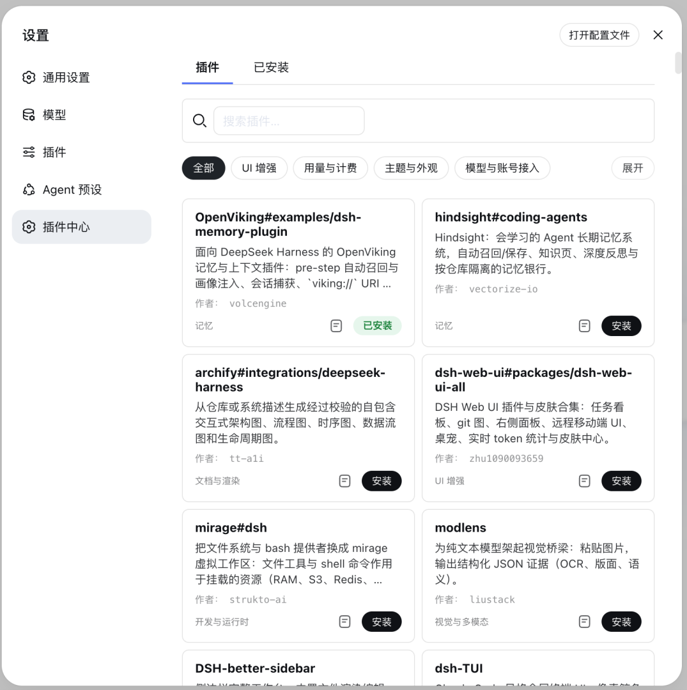

# dsh-featured-plugins

DSH 精选插件中心：在设置页里浏览、搜索、安装、验证并更新社区插件。它复用宿主自己的插件命令（而非内置一套安装逻辑），因此同一个包可以同时服务 `dsh` 宿主和改名后的 `dsw` 宿主，无需任何配置。

> 项目处于早期阶段（`0.1.0`）。
>
> [English version →](README.en.md)



## 功能

- **浏览目录**：内置精选插件快照（`data/registry-snapshot.json`），按分类筛选，中英文描述与截图。
- **一键安装 / 卸载**：通过宿主的 `plugin add` / `plugin remove` 命令执行，安装目标由服务端从精选目录解析（客户端只传 registry 条目 URL，不传任意目标）。
- **状态视图**：展示每个已装插件的激活状态（`live` / `restart` / `inert` / `broken` / `missing`）。
- **启用 / 禁用**：写入 profile 状态文件，下次宿主启动生效（中心不做热卸载）。
- **更新检测**：npm 包用 semver 比较，GitHub 安装用 commit SHA 对比，30 分钟 TTL 缓存。

## 安装

```bash
dsh plugin --profile web add dsh-featured-plugins
```

> `web` 是 profile 名，请替换为你实际的 profile 名称。若你的 DSH home 目录不是默认的 `~/.dsh`，请显式带上 `DSH_HOME`，例如 `DSH_HOME=/Users/mac/.deepseek-work dsh plugin --profile web add dsh-featured-plugins`。
>
> 安装完成后需**重启宿主进程**（`client-modules` 的插件缓存不会自动失效）。

### 通过 GitHub 仓库安装

也可以不经过 npm，直接从 GitHub 仓库安装，target 格式为 `github:owner/repo`：

```bash
dsh plugin --profile web add github:peter123023/dsh-featured-plugins
```

精选目录里的每个条目在服务端预先算好了安装目标（npm 包名优先、GitHub tarball 兜底），客户端只传 registry 条目 URL、不传任意 target，所以以上命令仅用于手动安装；通过中心 UI 安装时会自动解析正确的 target。

## 架构

```
src/
  index.ts     宿主入口：apply(ctx, config)，注入 webServer + loader 后挂载路由
  config.ts    配置解析：profile、registry URL、缓存 TTL
  routes.ts    HTTP 路由层（解析请求 → 调用服务 → 序列化响应）
  registry.ts  目录加载（远端 registry + 内置快照兜底）、安装目标决策
  spawn.ts     插件命令执行（spawn 宿主自己的 plugin 命令）
  profile.ts   读 profile bundles / 已装插件 / 入口检测
  verify.ts    激活状态机（live/restart/inert/broken/missing）
  updates.ts   更新检测
  state.ts     持久化禁用集合（.dsh-featured-plugins/state.json）
  client/      设置页 UI（MarketSection.tsx + 样式 + 语言包）
data/
  registry-snapshot.json  内置精选插件快照（远端不可用时的兜底）
```

## 开发

```bash
# 安装依赖（deepseek-work workspace 成员，仅用于依赖解析）
pnpm install

# 构建（服务端 tsc + 客户端 tsdown）
pnpm build

# 类型检查
pnpm typecheck

# 测试
pnpm test
```

宿主环境要求 `@deepseek-ai/cordis ^4.0.1`（peerDependency）。

### 本地验证

中心通过宿主启动后，HTTP 路由挂在宿主 web server 上：

- `GET  /market/list`        精选目录 + 来源（远端 registry 或内置快照）
- `POST /market/install`     安装（body: `{ url }`，需同源）
- `POST /market/remove`      卸载（body: `{ name }`）
- `POST /market/set-enabled` 启用/禁用（body: `{ name, enabled }`）
- `GET  /market/status`      已装插件 + 激活状态
- `POST /market/cancel`      取消进行中的安装

## License

MIT
